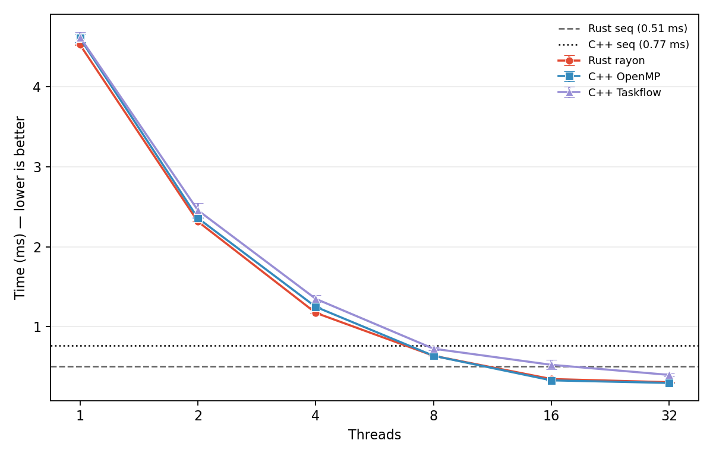
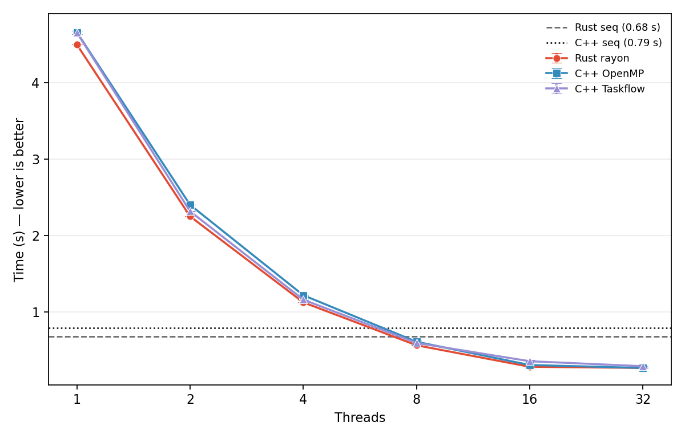
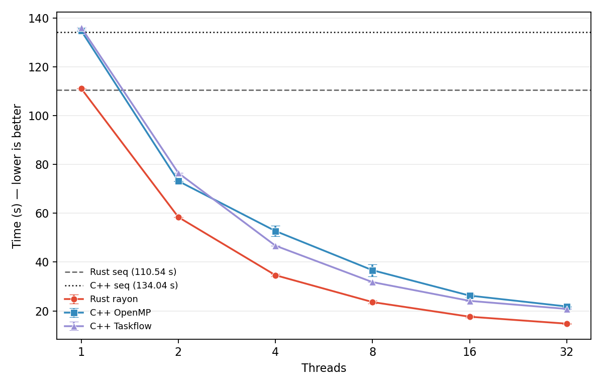
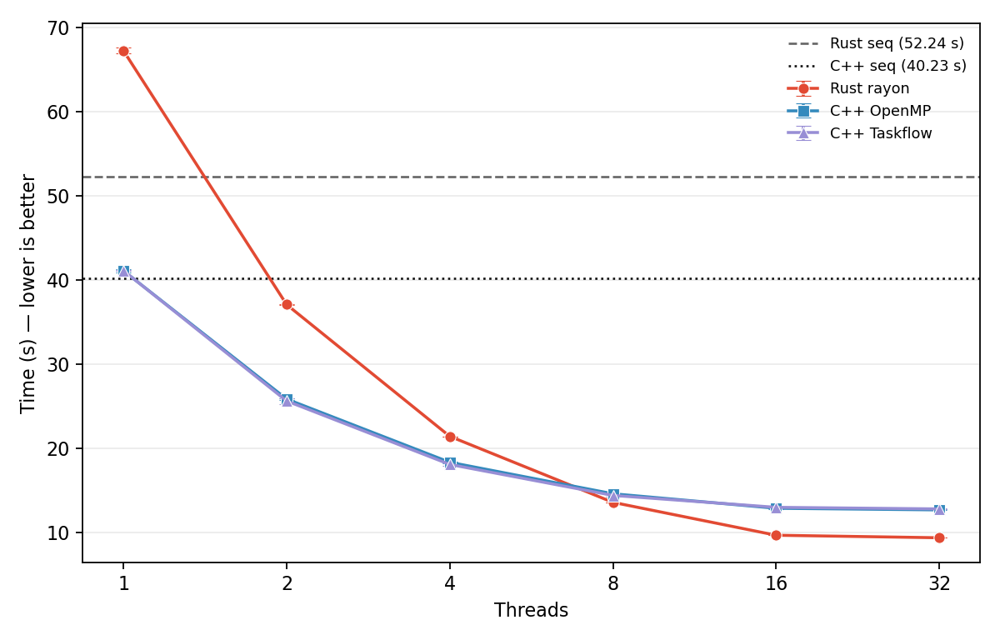
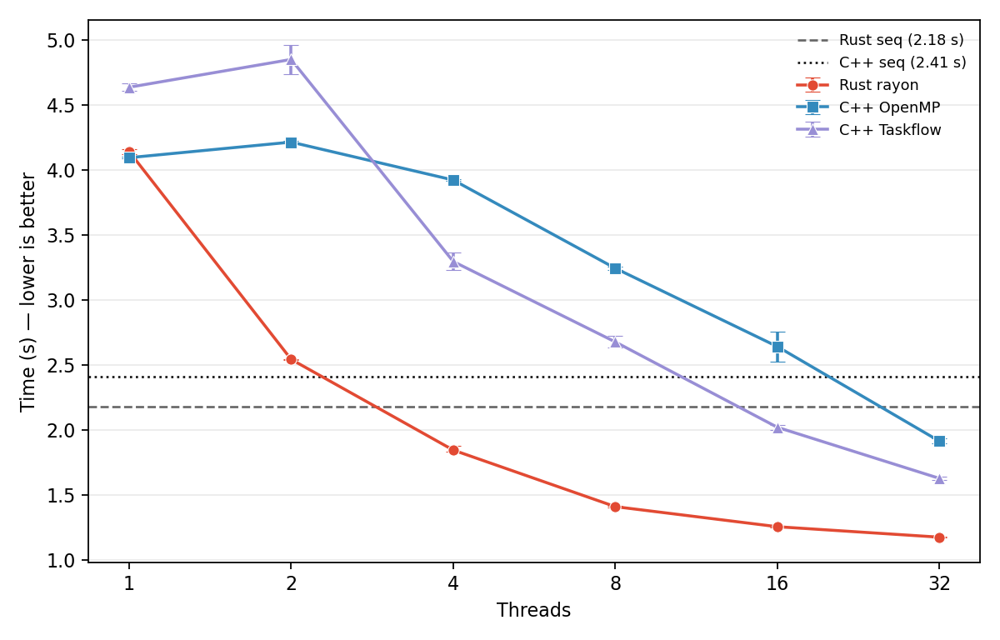

# benchrc Benchmark Report

## Machine

- **CPU**: AMD EPYC 7302P 16-Core Processor
- **Cores / Threads**: 16 / 32
- **RAM**: 125 GiB
- **OS**: Ubuntu 24.04
- **Kernel**: 6.8.0-117-generic
- **GCC**: 13.3.0
- **Rust**: 1.96.0

## Method

- Rust: Criterion, 10 samples, 10 s warmup, 60 s measurement time, `opt-level=3`, `lto=true`.
- C++: Google Benchmark, Release build, 10 repetitions, 10 s warmup, real-time wall-clock mode.
- Throughput reported as Gelem/s (billions of elements per second) or Melem/s as appropriate.
- Datasets generated via `python3 scripts/generate_datasets.py`; stored in `datasets/`.

---

## 1. Histogram

**Algorithm:** Count occurrences of values modulo 256. 256 buckets. Each thread processes a chunk into a local histogram, then all locals are reduced into a global histogram.

### 1M elements (`histogram_uniform_1m`)

| Variant | Rust (rayon) | C++ (OpenMP) | C++ (Taskflow) |
|---------|-------------|-------------|----------------|
| **seq** | 508.2 µs | 767.7 µs | — |
| **1 thread** | 4.52 ms | 4.61 ms | 4.62 ms |
| **2 threads** | 2.32 ms | 2.36 ms | 2.46 ms |
| **4 threads** | 1.17 ms | 1.25 ms | 1.35 ms |
| **8 threads** | 637.2 µs | 637.0 µs | 725.8 µs |
| **16 threads** | 346.7 µs | 330.0 µs | 524.2 µs |
| **32 threads** | 306.7 µs | 297.6 µs | 398.2 µs |

- Rust seq: 1.97 Gelem/s throughput.
- Best parallel (32t rayon): 3.26 Gelem/s (6.4× over 1t rayon; only 1.7× over sequential due to parallel overhead on this tiny workload).

### 1B elements (`histogram_uniform_1b`)

| Variant | Rust (rayon) | C++ (OpenMP) | C++ (Taskflow) |
|---------|-------------|-------------|----------------|
| **seq** | 678.3 ms | 786.5 ms | — |
| **1 thread** | 4.50 s | 4.66 s | 4.65 s |
| **2 threads** | 2.25 s | 2.40 s | 2.32 s |
| **4 threads** | 1.12 s | 1.22 s | 1.16 s |
| **8 threads** | 563.2 ms | 608.9 ms | 593.4 ms |
| **16 threads** | 281.8 ms | 304.9 ms | 354.2 ms |
| **32 threads** | 266.5 ms | 266.5 ms | 289.1 ms |

- Rust seq: **16% faster** than C++ seq (678 ms vs 787 ms).
- Rust seq throughput: 1.47 Gelem/s.
- Rust rayon at 8 threads first breaks even with sequential (563 ms vs 678 ms).
- Rust rayon 32t throughput: 3.75 Gelem/s (2.5× speedup over Rust seq).
- C++ OpenMP: essentially ties Rust at 32 threads (266 ms).
- C++ Taskflow: slowest across the board; 32t only reaches 289 ms.

---

## 2. Mergesort

**Algorithm:** Recursive parallel mergesort (divide-and-conquer). Sub-arrays ≤ 1024 elements fall back to `sort_unstable` (Rust) / `std::sort` (C++). Data: 1B `u32` elements (4 GB).

### 1B elements (`mergesort_u32_1b`, cutoff=1024)

| Variant | Rust (rayon) | C++ (OpenMP) | C++ (Taskflow) |
|---------|-------------|-------------|----------------|
| **seq** | 110.5 s | 134.0 s | — |
| **1 thread** | 111.0 s | 134.7 s | 136.0 s |
| **2 threads** | 58.4 s | 73.2 s | 76.5 s |
| **4 threads** | 34.6 s | 52.7 s | 46.7 s |
| **8 threads** | 23.6 s | 36.7 s | 31.8 s |
| **16 threads** | 17.6 s | 26.3 s | 24.1 s |
| **32 threads** | 14.8 s | 21.8 s | 20.8 s |

- Rust seq: **18% faster** than C++ seq (110.5 s vs 134.0 s).
- Rust rayon 32t: **7.5× speedup** over Rust seq.
- C++ OpenMP 32t: only 6.1× speedup over C++ seq.
- Rust rayon 32t is **32% faster** than C++ OpenMP 32t.
- C++ Taskflow: intermediate; beats OpenMP at 4t and above but trails rayon.
- Rust rayon 1t overhead is negligible (~0.5 s) thanks to work-stealing efficiency on large recursive tasks.
- Rust throughput at 32t: 67.6 Melem/s.

---

## 3. Stencil

**Algorithm:** 1D stencil — each element replaced by the average of itself and immediate neighbors (radius=1). Repeated 10 iterations. Data: 1B `f64` elements (8 GB). Memory-bound with neighbor dependence.

### 1B elements (`stencil_f64_1b`, 10 iterations, radius=1)

| Variant | Rust (rayon) | C++ (OpenMP) | C++ (Taskflow) |
|---------|-------------|-------------|----------------|
| **seq** | 52.2 s | 40.2 s | — |
| **1 thread** | 67.3 s | 41.1 s | 41.1 s |
| **2 threads** | 37.1 s | 25.8 s | 25.6 s |
| **4 threads** | 21.4 s | 18.3 s | 18.1 s |
| **8 threads** | 13.6 s | 14.6 s | 14.4 s |
| **16 threads** | 9.6 s | 12.9 s | 13.0 s |
| **32 threads** | 9.3 s | 12.7 s | 12.8 s |

- **C++ seq is 23% faster** than Rust seq (40.2 s vs 52.2 s). This is the only kernel where C++ leads sequentially — likely due to bounds-checking overhead in Rust's inner loop (`saturating_sub`, `min`).
- C++ OpenMP leads at low thread counts; Rust rayon pulls ahead at 8+ threads.
- Rust rayon 32t: **5.6× speedup** over Rust seq (52.2 s → 9.3 s).
- C++ OpenMP 32t: only 3.2× speedup over C++ seq (40.2 s → 12.7 s).
- Both implementations plateau at 16–32 threads due to memory bandwidth saturation.
- Rust 32t throughput: 107.0 Melem/s. C++ 32t throughput: ~79 Melem/s.
- C++ Taskflow closely tracks C++ OpenMP at all thread counts.

---

## 4. BFS

**Algorithm:** Level-synchronous breadth-first search on a 320M-node tree graph. Rust rayon uses `par_chunks` over frontier with atomic visited flags and local buffers per chunk. C++ OpenMP uses thread-local vectors with `#pragma omp critical` reduction. C++ Taskflow uses task-graph with explicit merge stages.

### 320M-node tree (`bfs_320m_tree`)

| Variant | Rust (rayon) | C++ (OpenMP) | C++ (Taskflow) |
|---------|-------------|-------------|----------------|
| **seq** | 2.18 s | 2.41 s | — |
| **1 thread** | 4.14 s | 4.10 s | 4.64 s |
| **2 threads** | 2.54 s | 4.22 s | 4.85 s |
| **4 threads** | 1.84 s | 3.92 s | 3.30 s |
| **8 threads** | 1.41 s | 3.24 s | 2.68 s |
| **16 threads** | 1.25 s | 2.64 s | 2.02 s |
| **32 threads** | 1.17 s | 1.91 s | 1.63 s |

- Rust seq: 9.5% faster than C++ seq (2.18 s vs 2.41 s). Rust seq throughput: 147 Melem/s.
- **Rust rayon dominates at all thread counts ≥ 2.**
- Rust rayon 32t: **1.9× speedup** over Rust seq; throughput: 273 Melem/s.
- C++ OpenMP 32t: only 1.3× speedup over C++ seq (2.41 s → 1.91 s); throughput: 168 Melem/s.
- C++ OpenMP 2t is actually **slower** than C++ seq (4.22 s vs 2.41 s) — the `#pragma omp critical` reduction path creates a severe bottleneck.
- Rust rayon 32t is **63% faster** than C++ OpenMP 32t (1.17 s vs 1.91 s).
- C++ Taskflow: performs between OpenMP and rayon; 32t at 1.63 s is 41% slower than Rust.

---

## 5. Rayon Overhead Microbenchmarks

Raw overhead costs of rayon primitives on this machine:

| Benchmark | Mean Time | What it measures |
|-----------|----------|-----------------|
| `rayon_join_empty` | 13.9 µs | `rayon::join(||{}, ||{})` with empty closures |
| `rayon_join_increment` | 13.9 µs | `rayon::join` assigning two integers |
| `rayon_par_iter_1k` | 64.6 µs | `par_iter().map().sum()` over 1K elements |
| `rayon_par_iter_100k` | 153.8 µs | `par_iter().map().sum()` over 100K elements |
| `rayon_threadpool_create` | 118.3 µs | `ThreadPoolBuilder::new().num_threads(4).build()` |
| `rayon_par_chunks_histogram` | 321.1 µs | Full histogram: chunks → map → reduce on 1M elements |
| `rayon_mergesort_10k_cutoff256` | 224.6 µs | Recursive parallel mergesort on 10K elements, cutoff=256 |

- Rayon `join` overhead is extremely low (~14 µs), making recursive divide-and-conquer efficient.
- Thread pool creation costs ~118 µs; pools are reused across benchmark iterations in practice.
- `par_iter` for 1K elements costs ~65 µs — parallelization only beneficial above this threshold.

---

## 6. Cross-Kernel Trends

### Rust vs C++ Sequential

| Kernel | Rust | C++ | Rust win |
|--------|-----|-----|----------|
| Histogram 1B | 678 ms | 787 ms | +16% |
| Mergesort 1B | 110.5 s | 134.0 s | +18% |
| Stencil 1B | 52.2 s | 40.2 s | −23% |
| BFS 320M | 2.18 s | 2.41 s | +9.5% |

Rust sequential wins 3 of 4. The stencil loss is attributable to bounds-checking overhead in the hot inner loop.

### Rust rayon vs C++ OpenMP at 32 threads

| Kernel | Rust 32t | C++ 32t | Rust win |
|--------|----------|---------|----------|
| Histogram 1B | 267 ms | 267 ms | tie |
| Mergesort 1B | 14.8 s | 21.8 s | +32% |
| Stencil 1B | 9.3 s | 12.7 s | +27% |
| BFS 320M | 1.17 s | 1.91 s | +63% |

Rust rayon wins or ties all 4 at scale. Mergesort and BFS show the largest gaps, where rayon's work-stealing scheduler handles irregular/dynamic workloads far better than OpenMP's fork-join model.

### C++ Taskflow vs C++ OpenMP

Taskflow is consistently the slowest parallel backend at low thread counts. At higher thread counts (16–32), Taskflow sometimes narrows the gap with OpenMP (stencil: 12.8 s vs 12.7 s) and occasionally beats it (mergesort: 20.8 s vs 21.8 s at 32t). Taskflow's task-graph construction overhead dominates at low thread counts.

### Scaling Efficiency

| Kernel | Rust speedup (seq→32t) | C++ speedup (seq→32t) |
|--------|------------------------|------------------------|
| Histogram 1B | 2.5× | 3.0× |
| Mergesort 1B | 7.5× | 6.1× |
| Stencil 1B | 5.6× | 3.2× |
| BFS 320M | 1.9× | 1.3× |

- Mergesort scales best: divide-and-conquer with local work fits work-stealing perfectly.
- BFS scales worst on both languages: atomic contention and frontier synchronization limit gains.
- Rust consistently scales better than C++ except on histogram (where C++ OpenMP has slightly better 1t→32t scaling due to a lower 1-thread baseline).

---

## 7. Comparison with RPB (SPAA '24)

The [RPB](https://github.com/mcj-group/rpb) (Rust Parallel Benchmarks) suite from SPAA 2024 covers 12 kernels (vs benchrc's 5) and focuses on Rust safety-vs-performance tradeoffs across multiple Rust backends (rayon, enhanced_rayon, parlay, multiqueue). Only histogram and BFS overlap between the two suites.

Key differences:
- **RPB is Rust-only** with no C++ comparison; benchrc provides the only public Rust-vs-C++ parallel data at this scale.
- **RPB covers irregular parallelism** (MIS, maximal matching, spanning forest, Delaunay refinement) that benchrc does not.
- **RPB quantifies safety costs** via feature flags (`sng_ind_safe` vs `sng_ind_unsafe`); benchrc always uses safe Rust.
- **benchrc tests at extreme scale** (1B elements; 320M nodes) while RPB uses standard PBBS input sizes.

The suites are complementary: benchrc answers "Rust or C++ for parallel HPC?" while RPB answers "what does safe parallelism cost in Rust?"

## 8. Raw Data

Full raw benchmark outputs are available in `plots/raw/`:
- `rust_histogram.txt`, `cpp_histogram.txt`
- `rust_mergesort.txt`, `cpp_mergesort.txt`
- `rust_stencil.txt`, `cpp_stencil.txt`
- `rust_bfs.txt`, `cpp_bfs.txt`
- `rust_rayon_overhead.txt`
- `rust_bfs_unoptimized.txt`, `cpp_bfs_unoptimized.txt` (earlier run, smaller graph, poor scaling)
